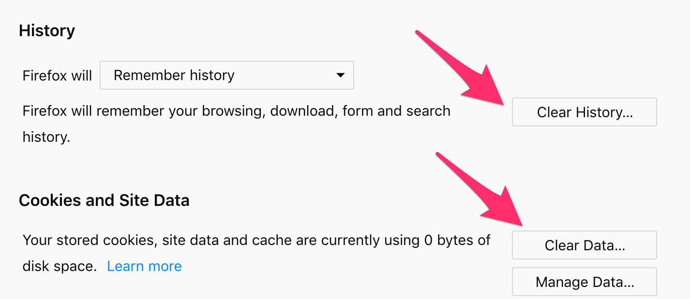

# Setup Steps
1. Install Global Consent Manager from the addons.mozilla.org website.
  https://addons.mozilla.org/en-US/firefox/addon/global-consent-manager/?src=search
2. Install FoxyProxy for spoofing a European IP Address
  user: bingetomato
  pw: bereftaction
  https://help.getfoxyproxy.org/index.php/knowledge-base/proxy-firefox-no-extension/
3. Morae Installed (Probably already the case in usability lab)
4. Define the news items for the day, and list of sites to look at.
  Monday, October 15: Find out the background, context, and involved organizations and people in stories about "Jamal Khashoggi".  Also, what is his profession?
5. Give the users a choice of looking for information related to the news item of the day from 3 of these websites (they can choose which ones, or click all 6 and choose 3 to focus on)
    1. https://bbc.com
    2. https://dailymail.co.uk
    3. https://independent.co.uk
    4. https://theguardian.co.uk
    5. https://worldcrunch.com
    6. https://www.mediapart.fr/en/english
6. Task from websites:
  - Bookmark information related to news item they think they might want to refer to later
  - Make hand written notes on paper about 3 individuals and 2 organizations that play a role in the event, and to summarize that role in 1 or 2 sentences for each individual and organization.
7. In between each person, we need to clear the browser data and cookies: Paste in browser: *about:preferences#privacy*

